<!-- _class: lead -->

# Chattanooga Generative AI Working Group Repository Kickoff

Marp decks, Mermaid diagrams, and shareable artifacts with one workflow

---

## What This Repository Is For

- Build technical talks in plain Markdown
- Keep diagrams versionable in Mermaid source
- Produce browser-ready HTML and shareable PDF artifacts
- Reuse Copilot skills and agents instead of reinventing the workflow each month

---

## Content Model



- Markdown is the source of truth
- Mermaid diagrams render to SVG for slide clarity
- Marp turns the deck into presentation and sharing formats
- The repo keeps authoring, export, and revision in one place

---

## Shared Copilot Capabilities

| Capability | Purpose |
| --- | --- |
| Technical Markdown skill | Abstracts, handouts, companion notes |
| Mermaid diagram skill | Architecture, sequence, and flow diagrams |
| Marp production skill | Deck authoring and HTML/PDF export |
| Build producer agent | Final artifact generation and verification |

---

## Release Workflow

```bash
npm install
npm run build:mermaid
npm run build:html
npm run build:pdf
```

- HTML supports live presentation in a browser
- PDF supports post-event sharing and distribution

---

## Standard For Future Decks

- One clear idea per slide
- Diagrams when structure beats prose
- Short titles and high-signal bullets
- Talk-specific detail in a handout, not crammed into slides

---

## Next Step

- Pick the next meetup topic
- Draft the outline in Markdown
- Add the diagram source as `.mmd`
- Export when the story is ready
