<!-- _class: lead -->

# Three Fronts of the AI Race

Faster releases, tighter control, and infrastructure pressure all at once

---

## Tonight's Opener

> Over the last month, AI has moved in three directions at once: faster model releases, tighter control over usage and distribution, and a growing recognition that energy and infrastructure are now core parts of the AI race.

- Everything else tonight is evidence for that sentence.

---

## Compressed Timeline

- By Feb. 3-5, coverage paired AI power economics with Anthropic's push toward agent teams and longer-context coding workflows. <a href="#appendix-a01">A01</a>
- Early-to-mid March coverage kept emphasizing infrastructure constraints while DeepSeek V4 talk reinforced a faster release cadence. <a href="#appendix-a02">A02</a>
- Late March through early April showed that usage limits and gated previews were becoming part of competitive positioning alongside new model announcements. <a href="#appendix-a03">A03</a>

<!--
This slide is a synthesis of the dated source-backed items used later in the deck.
Core anchors: Bloomberg (Feb. 3, 2026), TechCrunch (Feb. 5, 2026), TechNode (Mar. 2, 2026), Reuters (Mar. 17-18, 2026), The New Stack (Mar. 31, 2026), OpenAI (Mar. 31, 2026), Microsoft AI (Apr. 2, 2026), Google (Apr. 2, 2026), Anthropic Project Glasswing (Apr. 7, 2026).
-->

---

## The New Shape of Competition

---

## Front 1: Release Velocity

- Feb. 5: Anthropic released Opus 4.6 with agent teams, a coding focus, and a longer context window for more sustained work. <a href="#appendix-a04">A04</a>
- Early March DeepSeek V4 reporting, and later speculation around a mystery model, renewed attention on Chinese multimodal model competition. <a href="#appendix-a05">A05</a>
- By mid-March, roundup coverage and the Feb. 5 OpenAI-Anthropic timing framed AI as an ongoing release race. <a href="#appendix-a06">A06</a>
- Late March-early April: OpenAI, Microsoft, and Google each signaled another step up in product and model velocity. <a href="#appendix-a07">A07</a>

<!--
Speaker note citations:
TechCrunch, "Anthropic releases Opus 4.6 with new 'agent teams'," Feb. 5, 2026
https://techcrunch.com/2026/02/05/anthropic-releases-opus-4-6-with-new-agent-teams/

TechNode, "DeepSeek plans V4 multimodal model release this week, sources say," Mar. 2, 2026
https://technode.com/2026/03/02/deepseek-plans-v4-multimodal-model-release-this-week-sources-say/

Reuters, "A mystery AI model has developers buzzing: Is this DeepSeek’s latest blockbuster?" Mar. 17-18, 2026
https://www.reuters.com/business/media-telecom/mystery-ai-model-has-developers-buzzing-is-this-deepseeks-latest-blockbuster-2026-03-18/

TechCrunch, "The biggest AI stories of the year (so far)," Mar. 13, 2026
https://techcrunch.com/2026/03/13/the-biggest-ai-stories-of-the-year-so-far/

OpenAI, "OpenAI raises $122 billion to accelerate the next phase of AI," Mar. 31, 2026
https://openai.com/index/accelerating-the-next-phase-ai/

Microsoft AI, "Today we’re announcing 3 new world class MAI models, available in Foundry," Apr. 2, 2026
https://microsoft.ai/news/today-were-announcing-3-new-world-class-mai-models-available-in-foundry/

Google, "Gemma 4: Byte for byte, the most capable open models," Apr. 2, 2026
https://blog.google/innovation-and-ai/technology/developers-tools/gemma-4/
-->

---

## Front 2: Control Tightened

- Late March: Anthropic confirmed it had been adjusting Claude's five-hour limits during peak hours, affecting session depth. <a href="#appendix-a08">A08</a>
- Mar. 31-Apr. 1: Claude Code users reported hitting limits much sooner than expected, with complaints focused on vague explanations. <a href="#appendix-a09">A09</a>
- Apr. 4: Anthropic stopped allowing Pro and Max subscription allotments to cover OpenClaw-style third-party harness use and shifted those flows to separate metered billing. <a href="#appendix-a10">A10</a>
- Apr. 6-8: Mythos Preview appeared partner-limited, suggesting selective rollout by design. <a href="#appendix-a11">A11</a>

<!--
Speaker note citations:
The New Stack, "Claude Code users say they’re hitting usage limits faster than normal," Mar. 31, 2026
https://thenewstack.io/claude-code-usage-limits/

Engadget, "Anthropic is doubling Claude’s usage limits during off-peak hours for the next two weeks," Mar. 15, 2026
https://www.engadget.com/ai/anthropic-is-doubling-claudes-usage-limits-during-off-peak-hours-for-the-next-two-weeks-163645928.html

TechCrunch, "Anthropic says Claude Code subscribers will need to pay extra for OpenClaw usage," Apr. 4, 2026
https://techcrunch.com/2026/04/04/anthropic-says-claude-code-subscribers-will-need-to-pay-extra-for-openclaw-support/

Anthropic, "Project Glasswing," Apr. 7, 2026
https://www.anthropic.com/project/glasswing

TechCrunch, "Anthropic debuts preview of powerful new AI model Mythos in new cybersecurity initiative," Apr. 7, 2026
https://techcrunch.com/2026/04/07/anthropic-mythos-ai-model-preview-security/
-->

---

## Front 3: Infrastructure Mattered

- Feb. 3: Bloomberg reported that Jensen Huang said the AI buildout could eventually lower energy costs as more electrical capacity comes online and AI improves energy generation and distribution. <a href="#appendix-a12">A12</a>
- March coverage kept returning to infrastructure constraints, especially data-center power, clean-energy procurement, and grid capacity. <a href="#appendix-a13">A13</a>
- By late March and early April, rollout limits and deployment access were clearly part of how providers positioned advanced models. <a href="#appendix-a14">A14</a>
- The race now spans power, compute infrastructure, and financing, not just model benchmarks. <a href="#appendix-a15">A15</a>

<!--
Speaker note citations:
Bloomberg, "Nvidia CEO Says AI Build-Out Will Eventually Lower Energy Costs," Feb. 3, 2026
https://www.bloomberg.com/news/articles/2026-02-03/nvidia-ceo-says-ai-build-out-will-eventually-lower-energy-costs

CNBC, "Who is really footing the AI energy bill? Inside the debate about data center electricity costs," Mar. 13, 2026
https://www.cnbc.com/2026/03/13/ai-data-centers-electricity-prices-backlash-ratepayer-protection.html

Reuters, "AI power dash transforms clean energy offtake market," Mar. 17, 2026
https://www.reuters.com/business/energy/ai-power-dash-transforms-clean-energy-offtake-market--reeii-2026-03-17/

Reuters, "Soaring AI demand spurs roll-out of long duration energy storage," Mar. 26, 2026
https://www.reuters.com/business/energy/soaring-ai-demand-spurs-roll-out-long-duration-energy-storage--reeii-2026-03-24/
-->

---

## What This Means For The Room

- Model choice is now only one layer of the decision.
- Access policy can break a workflow even when the underlying model improves.
- Open models matter partly because they reduce dependence on someone else's gating logic.
- Cost, latency, and capacity planning are now product questions, not just ops questions.

---

## Discussion Prompts

- Which matters more this quarter: better models or more stable access?
- Where do open-weight models change the risk picture for teams here?
- What breaks first in your stack if a provider tightens capacity or distribution rules?
- Which part of the infrastructure story feels most underpriced today: power, chips, or delivery?

---

## Appendix

Use the superscript source links on factual bullets to jump to the supporting appendix page.

---

## Appendix A01

- Claim: By Feb. 3-5, coverage paired AI power economics with Anthropic's push toward agent teams and longer-context coding workflows.
- [Bloomberg: Nvidia CEO Says AI Build-Out Will Eventually Lower Energy Costs](https://www.bloomberg.com/news/articles/2026-02-03/nvidia-ceo-says-ai-build-out-will-eventually-lower-energy-costs)
- [TechCrunch: Anthropic releases Opus 4.6 with new 'agent teams'](https://techcrunch.com/2026/02/05/anthropic-releases-opus-4-6-with-new-agent-teams/)

---

## Appendix A02

- Claim: Early-to-mid March coverage kept emphasizing infrastructure constraints while DeepSeek V4 talk reinforced a faster release cadence.
- [CNBC: Who is really footing the AI energy bill?](https://www.cnbc.com/2026/03/13/ai-data-centers-electricity-prices-backlash-ratepayer-protection.html)
- [TechNode: DeepSeek plans V4 multimodal model release this week, sources say](https://technode.com/2026/03/02/deepseek-plans-v4-multimodal-model-release-this-week-sources-say/)
- [TechCrunch: The biggest AI stories of the year (so far)](https://techcrunch.com/2026/03/13/the-biggest-ai-stories-of-the-year-so-far/)

---

## Appendix A03

- Claim: Late March through early April showed that usage limits and gated previews were becoming part of competitive positioning alongside new model announcements.
- [The New Stack: Claude Code users say they’re hitting usage limits faster than normal](https://thenewstack.io/claude-code-usage-limits/)
- [OpenAI: OpenAI raises $122 billion to accelerate the next phase of AI](https://openai.com/index/accelerating-the-next-phase-ai/)
- [Microsoft AI: Today we’re announcing 3 new world class MAI models, available in Foundry](https://microsoft.ai/news/today-were-announcing-3-new-world-class-mai-models-available-in-foundry/)
- [Anthropic: Project Glasswing](https://www.anthropic.com/project/glasswing)

---

## Appendix A04

- Claim: Anthropic's Feb. 5 Opus 4.6 release centered on agent teams, coding, and a longer context window.
- [TechCrunch: Anthropic releases Opus 4.6 with new 'agent teams'](https://techcrunch.com/2026/02/05/anthropic-releases-opus-4-6-with-new-agent-teams/)
- [TechCrunch: OpenAI launches new agentic coding model only minutes after Anthropic drops its own](https://techcrunch.com/2026/02/05/openai-launches-new-agentic-coding-model-only-minutes-after-anthropic-drops-its-own/)

---

## Appendix A05

- Claim: Early March DeepSeek V4 reporting, and later speculation around a mystery model, renewed attention on Chinese multimodal model competition.
- [TechNode: DeepSeek plans V4 multimodal model release this week, sources say](https://technode.com/2026/03/02/deepseek-plans-v4-multimodal-model-release-this-week-sources-say/)
- [Reuters: A mystery AI model has developers buzzing: Is this DeepSeek’s latest blockbuster?](https://www.reuters.com/business/media-telecom/mystery-ai-model-has-developers-buzzing-is-this-deepseeks-latest-blockbuster-2026-03-18/)

---

## Appendix A06

- Claim: By mid-March, roundup coverage and the Feb. 5 OpenAI-Anthropic timing framed AI as an ongoing release race.
- [TechCrunch: The biggest AI stories of the year (so far)](https://techcrunch.com/2026/03/13/the-biggest-ai-stories-of-the-year-so-far/)
- [TechCrunch: OpenAI launches new agentic coding model only minutes after Anthropic drops its own](https://techcrunch.com/2026/02/05/openai-launches-new-agentic-coding-model-only-minutes-after-anthropic-drops-its-own/)

---

## Appendix A07

- Claim: Late March and early April showed another step up in product and model velocity across major platforms.
- [OpenAI: OpenAI raises $122 billion to accelerate the next phase of AI](https://openai.com/index/accelerating-the-next-phase-ai/)
- [Microsoft AI: Today we’re announcing 3 new world class MAI models, available in Foundry](https://microsoft.ai/news/today-were-announcing-3-new-world-class-mai-models-available-in-foundry/)
- [Google: Gemma 4: Byte for byte, the most capable open models](https://blog.google/innovation-and-ai/technology/developers-tools/gemma-4/)

---

## Appendix A08

- Claim: By late March, Anthropic had been adjusting five-hour limits during peak periods.
- [The New Stack: Claude Code users say they’re hitting usage limits faster than normal](https://thenewstack.io/claude-code-usage-limits/)
- [Engadget: Anthropic is doubling Claude’s usage limits during off-peak hours for the next two weeks](https://www.engadget.com/ai/anthropic-is-doubling-claudes-usage-limits-during-off-peak-hours-for-the-next-two-weeks-163645928.html)
- [Anthropic Support: How do usage and length limits work?](https://support.claude.com/en/articles/11647753-how-do-usage-and-length-limits-work)

---

## Appendix A09

- Claim: Users reported Claude Code limits arriving sooner and described Anthropic's communication as vague.
- [The New Stack: Claude Code users say they’re hitting usage limits faster than normal](https://thenewstack.io/claude-code-usage-limits/)
- [Anthropic Support: Usage limit best practices](https://support.claude.com/en/articles/9797557-usage-limit-best-practices)
- [Anthropic Support: How do usage and length limits work?](https://support.claude.com/en/articles/11647753-how-do-usage-and-length-limits-work)

---

## Appendix A10

- Claim: Anthropic stopped allowing Pro and Max subscription allotments to cover OpenClaw-style harness use and shifted those flows to separate metered billing.
- [TechCrunch: Anthropic says Claude Code subscribers will need to pay extra for OpenClaw usage](https://techcrunch.com/2026/04/04/anthropic-says-claude-code-subscribers-will-need-to-pay-extra-for-openclaw-support/)
- [The New Stack: Anthropic’s harness shakeup 'just fragments workflows,' developers warn](https://thenewstack.io/anthropic-claude-harness-restrictions/)
- [Anthropic Support: Using Claude Code with your Pro or Max plan](https://support.claude.com/en/articles/11145838-using-claude-code-with-your-pro-or-max-plan)

---

## Appendix A11

- Claim: Mythos Preview was selectively rolled out rather than broadly released.
- [Anthropic: Project Glasswing](https://www.anthropic.com/project/glasswing)
- [TechCrunch: Anthropic debuts preview of powerful new AI model Mythos in new cybersecurity initiative](https://techcrunch.com/2026/04/07/anthropic-mythos-ai-model-preview-security/)
- [The New Stack: Anthropic’s Claude Mythos is now available, but not for you](https://thenewstack.io/anthropic-claude-mythos-cybersecurity/)

---

## Appendix A12

- Claim: Bloomberg reported Huang saying the AI buildout could eventually lower energy costs as capacity and energy AI improve.
- [Bloomberg: Nvidia CEO Says AI Build-Out Will Eventually Lower Energy Costs](https://www.bloomberg.com/news/articles/2026-02-03/nvidia-ceo-says-ai-build-out-will-eventually-lower-energy-costs)

---

## Appendix A13

- Claim: March coverage kept returning to infrastructure constraints, especially data-center power, clean-energy procurement, and grid capacity.
- [CNBC: Who is really footing the AI energy bill?](https://www.cnbc.com/2026/03/13/ai-data-centers-electricity-prices-backlash-ratepayer-protection.html)
- [Reuters: AI power dash transforms clean energy offtake market](https://www.reuters.com/business/energy/ai-power-dash-transforms-clean-energy-offtake-market--reeii-2026-03-17/)
- [Reuters: Soaring AI demand spurs roll-out of long duration energy storage](https://www.reuters.com/business/energy/soaring-ai-demand-spurs-roll-out-long-duration-energy-storage--reeii-2026-03-24/)

---

## Appendix A14

- Claim: By late March and early April, rollout limits and deployment access were clearly part of how providers positioned advanced models.
- [The New Stack: Claude Code users say they’re hitting usage limits faster than normal](https://thenewstack.io/claude-code-usage-limits/)
- [Anthropic: Project Glasswing](https://www.anthropic.com/project/glasswing)
- [Microsoft AI: Today we’re announcing 3 new world class MAI models, available in Foundry](https://microsoft.ai/news/today-were-announcing-3-new-world-class-mai-models-available-in-foundry/)

---

## Appendix A15

- Claim: The race now spans power, compute infrastructure, and financing, not just model benchmarks.
- [Bloomberg: Nvidia CEO Says AI Build-Out Will Eventually Lower Energy Costs](https://www.bloomberg.com/news/articles/2026-02-03/nvidia-ceo-says-ai-build-out-will-eventually-lower-energy-costs)
- [CNBC: Who is really footing the AI energy bill?](https://www.cnbc.com/2026/03/13/ai-data-centers-electricity-prices-backlash-ratepayer-protection.html)
- [OpenAI: OpenAI raises $122 billion to accelerate the next phase of AI](https://openai.com/index/accelerating-the-next-phase-ai/)

---

## Internal Editorial Confidence

- Exact source matches: A04, A08, A09, A10, A11, A12.
- Defensible but synthesis-backed: A01, A02, A03, A05, A06, A07, A13, A14, A15.
- Highest caution: A05 and A13 still depend partly on partial Reuters access in this validation environment.
- If this deck is republished beyond the meetup, re-check Reuters originals and consider one more softening pass on the synthesis bullets.
