<!-- _class: lead -->

# Agentic AI Leaves The Sandbox

Pricing, security, and enterprise control in May 2026

<!-- cover-links -->

---

## Tonight's Claim

- May 2026 looks like the point when agentic AI stopped behaving like a feature demo and started behaving like real infrastructure. <a href="#appendix-a01">A01</a><a href="#appendix-a03">A03</a><a href="#appendix-a05">A05</a><a href="#appendix-a07">A07</a><a href="#appendix-a09">A09</a><a href="#appendix-a10">A10</a>
- The signals show up at six layers at once: model pricing, developer tooling, cyber capability, enterprise deployment, org design, and infrastructure capital. <a href="#appendix-a01">A01</a><a href="#appendix-a03">A03</a><a href="#appendix-a05">A05</a><a href="#appendix-a07">A07</a><a href="#appendix-a09">A09</a><a href="#appendix-a10">A10</a><a href="#appendix-a11">A11</a>

---

## One Shift, Six Layers

---

## Cost Continues to Rise
### Last Time it was GitHub Copilot, now it's Gemini 3.5 Flash

- Google made Gemini 3.5 Flash its GA agentic and coding model with a 1M token context window, 65K max output, and preserved thoughts across turns. <a href="#appendix-a01">A01</a><a href="#appendix-a02">A02</a>
- Paid pricing is $1.50 per 1M input tokens and $9 per 1M output tokens, versus $0.50 and $3 for Gemini 3 Flash Preview. <a href="#appendix-a01">A01</a>
- Google warns that preserved thoughts increase input token count over multi-turn sessions, which can raise costs unless you clear them for simple queries. <a href="#appendix-a02">A02</a>

---

## Google Wants One Dev Shell

- Google says Gemini CLI and Gemini Code Assist IDE extensions for Gemini Code Assist for individuals, Google AI Pro, and Google AI Ultra will stop serving requests on June 18, 2026, as consumer users are moved to Antigravity CLI. <a href="#appendix-a03">A03</a>
- Google explicitly says there will not be 1:1 feature parity right out of the gate. <a href="#appendix-a03">A03</a>
- GitHub issues filed after the transition announcement include requests for a standalone Gemini CLI path, reports of OAuth quota problems, and an Antigravity CLI startup panic. <a href="#appendix-a04">A04</a>

---

## Cyber Capability Is Accelerating

- The AI Security Institute (AISI) says GPT-5.5 scored 71.4% on expert cyber tasks versus 68.6% for Mythos Preview, making it one of the strongest cyber models it has tested. <a href="#appendix-a05">A05</a>
- AISI says GPT-5.5 was the second model to complete its end-to-end corporate network attack simulation, and its red team identified a universal jailbreak during safeguards testing. <a href="#appendix-a05">A05</a>
- AISI says frontier cyber task horizons are doubling on the order of months, not years. <a href="#appendix-a06">A06</a>

---

## Enterprise Deployment Hardens

- OpenAI and Dell are connecting Codex to Dell AI Data Platform and exploring how it could interface with Dell AI Factory so agents can run closer to governed enterprise data and systems. <a href="#appendix-a07">A07</a>
- OpenAI says more than 4 million developers now use Codex each week. <a href="#appendix-a07">A07</a>
- Anthropic acquired Stainless to deepen SDK generation, CLI tooling, and MCP server connectivity around Claude. <a href="#appendix-a08">A08</a>

---

## AI Rewrites The Org Chart

- Reuters says Meta's May reorganization includes laying off about 10% of staff, moving 7,000 employees into AI initiatives, and flattening management. <a href="#appendix-a09">A09</a>
- Meta's internal memo says many org leaders incorporated AI-native design principles and smaller pods or cohorts into the new structure. <a href="#appendix-a09">A09</a>
- This is what AI adoption looks like when it becomes headcount and workflow strategy, not just a tool rollout. <a href="#appendix-a09">A09</a>

---

## Infrastructure Becomes The Market Story

- Cerebras turned its IPO path into a real May 14 debut, raising $5.55 billion in the largest U.S. IPO of the year so far. <a href="#appendix-a10">A10</a>
- Reuters says demand was driven in part by AI infrastructure enthusiasm plus Cerebras ties to AWS and OpenAI. <a href="#appendix-a10">A10</a>
- Cerebras says Kimi K2.6 is now in enterprise trials and cites an Artificial Analysis measurement of 981 output tokens per second on a private Cerebras endpoint. <a href="#appendix-a11">A11</a>

---

## What Builders Should Watch

- Model choice is now entangled with token economics, auth path, CLI or agent platform, and where enterprise context actually lives. <a href="#appendix-a01">A01</a><a href="#appendix-a02">A02</a><a href="#appendix-a03">A03</a><a href="#appendix-a07">A07</a><a href="#appendix-a08">A08</a>
- Security teams should assume frontier coding and agent models are becoming materially more capable at vulnerability discovery and attack chaining. <a href="#appendix-a05">A05</a><a href="#appendix-a06">A06</a>
- The real buying question is no longer "which model is best?" but "which stack can we afford, govern, and trust in production?" <a href="#appendix-a01">A01</a><a href="#appendix-a03">A03</a><a href="#appendix-a07">A07</a><a href="#appendix-a08">A08</a><a href="#appendix-a09">A09</a><a href="#appendix-a10">A10</a>

---

## Close

- May 2026 feels like the month agentic AI stopped looking like a feature race and started looking like a platform shift. <a href="#appendix-a01">A01</a><a href="#appendix-a03">A03</a><a href="#appendix-a05">A05</a><a href="#appendix-a07">A07</a><a href="#appendix-a09">A09</a><a href="#appendix-a10">A10</a>
- Builders now have to price the workflow, secure the agent, and choose the platform path. <a href="#appendix-a01">A01</a><a href="#appendix-a03">A03</a><a href="#appendix-a05">A05</a><a href="#appendix-a07">A07</a><a href="#appendix-a08">A08</a><a href="#appendix-a09">A09</a>

---

## Appendix

Use the superscript source links on factual bullets to jump to the supporting appendix page.

---

## Appendix A01

- Claim: Google launched Gemini 3.5 Flash as its GA agentic and coding model, and the new Flash price tier is materially higher than Gemini 3 Flash Preview.
- [Google: Gemini 3.5: frontier intelligence with action](https://blog.google/innovation-and-ai/models-and-research/gemini-models/gemini-3-5/)
- [Gemini Developer API pricing](https://ai.google.dev/gemini-api/docs/pricing)

---

## Appendix A02

- Claim: Gemini 3.5 Flash preserves reasoning context across turns, and Google says that preserved thoughts increase input token count in multi-turn sessions and can be cleared for simple queries.
- [What's new in Gemini 3.5 Flash](https://ai.google.dev/gemini-api/docs/whats-new-gemini-3.5)

---

## Appendix A03

- Claim: Google is transitioning Gemini CLI and Gemini Code Assist IDE extensions for Gemini Code Assist for individuals, Google AI Pro, and Google AI Ultra to Antigravity CLI, with June 18, 2026 as the cutoff for those consumer workflows, and Google says there is not yet 1:1 feature parity.
- [Google Developers Blog: An important update: Transitioning Gemini CLI to Antigravity CLI](https://developers.googleblog.com/an-important-update-transitioning-gemini-cli-to-antigravity-cli/)
- [Gemini Code Assist release notes](https://developers.google.com/gemini-code-assist/resources/release-notes)

---

## Appendix A04

- Claim: Developers are reporting migration pain around Antigravity CLI, including requests for a legacy Gemini CLI path, OAuth quota problems, and startup panics.
- [GitHub issue #27314: Bring back standalone Gemini CLI or support full legacy workflow with stable OAuth](https://github.com/google-gemini/gemini-cli/issues/27314)
- [GitHub issue #27294: Antigravity CLI Panic](https://github.com/google-gemini/gemini-cli/issues/27294)

---

## Appendix A05

- Claim: AISI found GPT-5.5 near Mythos-level on advanced cyber tasks, the second model to solve its corporate attack range, and susceptible to a universal jailbreak during safeguards testing.
- [AISI: Our evaluation of OpenAI's GPT-5.5 cyber capabilities](https://www.aisi.gov.uk/blog/our-evaluation-of-openais-gpt-5-5-cyber-capabilities)

---

## Appendix A06

- Claim: AISI says frontier cyber task horizons are doubling on the order of months, and that GPT-5.5 and Mythos Preview exceeded earlier trends.
- [AISI: How fast is autonomous AI cyber capability advancing?](https://www.aisi.gov.uk/blog/how-fast-is-autonomous-ai-cyber-capability-advancing)

---

## Appendix A07

- Claim: OpenAI and Dell are moving Codex toward hybrid and on-prem enterprise environments, and OpenAI says Codex now has more than 4 million weekly developers.
- [OpenAI and Dell Technologies partner to bring Codex to hybrid and on-premises enterprise environments](https://openai.com/index/dell-codex-enterprise-partnership/)

---

## Appendix A08

- Claim: Anthropic acquired Stainless to extend Claude's reach into SDKs, CLIs, MCP servers, and agent connectivity.
- [Anthropic acquires Stainless](https://www.anthropic.com/news/anthropic-acquires-stainless)

---

## Appendix A09

- Claim: Meta's AI-led restructuring combines layoffs, transfers into AI initiatives, flatter management, and smaller AI-native teams.
- [Reuters: Exclusive: Meta lays out details of May 20 restructuring in internal document](https://www.reuters.com/world/meta-lays-out-plans-may-20-layoffs-restructuring-internal-document-says-2026-05-18/)

---

## Appendix A10

- Claim: Cerebras completed a major May 14 IPO debut, raising $5.55 billion and riding AI infrastructure enthusiasm, AWS ties, and OpenAI momentum.
- [Reuters: Cerebras shares skyrocket in debut as AI mania grips markets](https://www.reuters.com/legal/transactional/cerebras-set-debut-stock-market-gripped-by-ai-mania-2026-05-14/)

---

## Appendix A11

- Claim: Cerebras says Kimi K2.6 is in enterprise trials and cites Artificial Analysis measurements of 981 output tokens per second and a 5.6-second time to final answer for a 10,000-token request on a private Cerebras endpoint.
- [Cerebras Brings Trillion Parameter Inference to Enterprises with Kimi K2.6](https://www.cerebras.ai/blog/cerebras-kimi-k2-Enterprise)