<!-- _class: lead -->

# The AI Tool Bill Has Layers

Plan tiers, usage meters, and runtime costs in May 2026

<!-- cover-links -->

---

## Tonight's Claim

- Across GitHub Copilot, Claude, and OpenAI, pricing now spans plan access and usage meters, and in some cases a separate execution cost. <a href="#appendix-a01">A01</a><a href="#appendix-a02">A02</a><a href="#appendix-a03">A03</a><a href="#appendix-a04">A04</a><a href="#appendix-a05">A05</a><a href="#appendix-a06">A06</a>
- That shift is now visible across GitHub Copilot, Claude, and OpenAI's agent products, not just in API pricing tables. <a href="#appendix-a01">A01</a><a href="#appendix-a02">A02</a><a href="#appendix-a03">A03</a><a href="#appendix-a04">A04</a><a href="#appendix-a05">A05</a><a href="#appendix-a06">A06</a><a href="#appendix-a09">A09</a>

---

## The New Cost Stack

---

## GitHub Makes The Stack Obvious

- GitHub Copilot Pro includes 300 premium requests per month, while Pro+ includes 1,500, and extra premium requests cost $0.04 each. <a href="#appendix-a01">A01</a>
- Starting June 1, 2026, GitHub is moving Copilot from request-based billing to usage-based billing. <a href="#appendix-a01">A01</a>
- GitHub also assigns very different model multipliers to advanced models, including 7.5x for GPT-5.5 and 15x for Claude Opus 4.7. <a href="#appendix-a01">A01</a>

---

## Code Review Now Has A Runtime Bill Too

- GitHub says private-repo Copilot code review will start consuming GitHub Actions minutes on June 1, 2026, in addition to AI Credits. <a href="#appendix-a02">A02</a>
- Public repositories stay free for Actions minutes, but private reviews now inherit runner and budget decisions. <a href="#appendix-a02">A02</a>
- That means one workflow can now trigger both an AI meter and an execution meter. <a href="#appendix-a02">A02</a>

---

## Anthropic Turns Limits Into Soft Caps

- Claude Pro is $20 monthly or $17 per month billed annually, and Max starts at $100 per month for higher included usage. <a href="#appendix-a03">A03</a>
- With extra usage enabled and funded, paid Claude individual subscribers can continue past included limits at standard API rates. <a href="#appendix-a03">A03</a>
- Anthropic pairs that overage path with monthly caps, prepaid funds, and auto-reload controls. <a href="#appendix-a03">A03</a>

---

## Capacity Shows Up As Product Limits

- On May 6, Anthropic said it doubled Claude Code's five-hour limits for Pro, Max, Team, and seat-based Enterprise, and removed peak-hour reductions for Pro and Max. <a href="#appendix-a04">A04</a>
- Anthropic links the higher limits to broader compute expansion, including a SpaceX deal that adds more than 300 megawatts and 220,000+ NVIDIA GPUs from Colossus 1 within a month. <a href="#appendix-a04">A04</a>
- Anthropic is making the link between new compute capacity and higher product limits more explicit. <a href="#appendix-a04">A04</a>

---

## OpenAI Moves Pricing Into Workflows

- Workspace agents were free until May 6, 2026, with credit-based pricing starting that day. <a href="#appendix-a05">A05</a>
- GPT-5.5 API pricing is $5 per 1M input tokens and $30 per 1M output tokens, while GPT-5.5 Fast mode in Codex runs at 2.5x the cost. <a href="#appendix-a05">A05</a>
- OpenAI says GPT-5.5 is also more token efficient than GPT-5.4, alongside its capability gains. <a href="#appendix-a05">A05</a>

---

## Managed Agents Bundle More Of The Workflow

- Anthropic launched dreaming in Claude Managed Agents as a research preview on May 6, and made outcomes, multiagent orchestration, and webhooks available to developers building with Managed Agents. <a href="#appendix-a09">A09</a>
- Anthropic says those features are aimed at agents that improve across sessions, check work against explicit rubrics, and delegate tasks across specialist subagents. <a href="#appendix-a09">A09</a>
- Anthropic is expanding Claude Managed Agents with dreaming, outcomes, and multiagent orchestration, while OpenAI frames workspace agents as shared, memory-backed agents for long-running workflows. <a href="#appendix-a05">A05</a><a href="#appendix-a09">A09</a>

---

## Distribution Path Now Changes The Bill

- OpenAI's AWS launch adds OpenAI models to Amazon Bedrock, brings Codex to Bedrock in limited preview, and launches Bedrock Managed Agents powered by OpenAI. <a href="#appendix-a06">A06</a>
- OpenAI says more than 4 million people now use Codex every week, and Codex on Bedrock can apply eligible usage toward AWS commitments. <a href="#appendix-a06">A06</a>
- That turns cloud procurement and existing platform commitments into part of AI tool selection. <a href="#appendix-a06">A06</a>

---

## Infrastructure Is The Hidden Pricing Layer

- Google says TPU 8i improves inference performance-per-dollar by 80% over the prior generation, while TPU 8t delivers nearly 3x compute performance per pod for training. <a href="#appendix-a07">A07</a>
- DeepMind says Decoupled DiLoCo trained a 12B model across four U.S. regions using only 2 to 5 Gbps wide-area networking while maintaining benchmark performance. <a href="#appendix-a08">A08</a>
- These infrastructure announcements show that the hardware and training stack behind AI pricing is changing fast. <a href="#appendix-a04">A04</a><a href="#appendix-a07">A07</a><a href="#appendix-a08">A08</a>

---

## What Teams Should Ask First

- Before choosing a model, ask what is included in the base plan, what event triggers a paid meter, and where the work actually runs. <a href="#appendix-a01">A01</a><a href="#appendix-a02">A02</a><a href="#appendix-a03">A03</a><a href="#appendix-a05">A05</a><a href="#appendix-a06">A06</a>
- A cheaper model can still be the more expensive workflow if it burns premium multipliers, runtime minutes, or credit-based agent usage. <a href="#appendix-a01">A01</a><a href="#appendix-a02">A02</a><a href="#appendix-a05">A05</a>
- The new buying question is not just "which model is best," but "which cost stack fits our workflow, budget, and governance path." <a href="#appendix-a02">A02</a><a href="#appendix-a03">A03</a><a href="#appendix-a06">A06</a>

---

## Close

- May 2026 looks like a point when developer AI pricing became more visibly layered across plans and usage, with some workflows adding separate runtime costs. <a href="#appendix-a01">A01</a><a href="#appendix-a02">A02</a><a href="#appendix-a03">A03</a><a href="#appendix-a05">A05</a><a href="#appendix-a06">A06</a>
- The practical takeaway for builders is simple: price the workflow, not just the model. <a href="#appendix-a01">A01</a><a href="#appendix-a02">A02</a><a href="#appendix-a03">A03</a><a href="#appendix-a05">A05</a><a href="#appendix-a06">A06</a>

---

## Appendix

Use the superscript source links on factual bullets to jump to the supporting appendix page.

---

## Appendix A01

- Claim: GitHub Copilot now exposes plan-tier economics directly through premium request allowances, overage pricing, usage-based billing changes, and model multipliers.
- [GitHub Docs: About individual GitHub Copilot plans and benefits](https://docs.github.com/en/copilot/concepts/billing/individual-plans)
- [GitHub Docs: Requests in GitHub Copilot](https://docs.github.com/en/copilot/concepts/billing/copilot-requests)

---

## Appendix A02

- Claim: GitHub Copilot code review on private repositories will add a GitHub Actions runtime charge on top of Copilot AI billing starting June 1, 2026.
- [GitHub Changelog: GitHub Copilot code review will start consuming GitHub Actions minutes on June 1, 2026](https://github.blog/changelog/2026-04-27-github-copilot-code-review-will-start-consuming-github-actions-minutes-on-june-1-2026/)

---

## Appendix A03

- Claim: Anthropic now frames paid Claude plans as included usage plus optional overage billed at standard API rates with spending controls.
- [Claude Pricing](https://claude.com/pricing)
- [Anthropic Support: Manage extra usage for paid Claude plans](https://support.claude.com/en/articles/12429409-manage-extra-usage-for-paid-claude-plans)

---

## Appendix A04

- Claim: Anthropic explicitly connected higher Claude limits to new compute capacity from its SpaceX partnership.
- [Anthropic: Higher usage limits for Claude and a compute deal with SpaceX](https://www.anthropic.com/news/higher-limits-spacex)

---

## Appendix A05

- Claim: OpenAI is pricing higher-capability workflows through credits, API token pricing, and faster premium execution modes rather than a single flat access tier.
- [OpenAI: Introducing workspace agents in ChatGPT](https://openai.com/index/introducing-workspace-agents-in-chatgpt/)
- [OpenAI: Introducing GPT-5.5](https://openai.com/index/introducing-gpt-5-5/)

---

## Appendix A06

- Claim: OpenAI's AWS distribution makes cloud commitments, governance, and procurement part of the AI tool bill.
- [OpenAI: OpenAI models, Codex, and Managed Agents come to AWS](https://openai.com/index/openai-on-aws/)

---

## Appendix A07

- Claim: Google's TPU 8 announcement shows the infrastructure vendors are optimizing separately for training and agentic inference economics.
- [Google Cloud: Our eighth generation TPUs: two chips for the agentic era](https://blog.google/innovation-and-ai/infrastructure-and-cloud/google-cloud/eighth-generation-tpu-agentic-era/)

---

## Appendix A08

- Claim: DeepMind's Decoupled DiLoCo shows the compute stack itself is being redesigned to make frontier training more resilient and less network-constrained.
- [Google DeepMind: Decoupled DiLoCo: A new frontier for resilient, distributed AI training](https://deepmind.google/blog/decoupled-diloco/)

---

## Appendix A09

- Claim: Anthropic added dreaming, outcomes, multiagent orchestration, and webhooks to Claude Managed Agents.
- [Anthropic: New in Claude Managed Agents](https://claude.com/blog/new-in-claude-managed-agents)